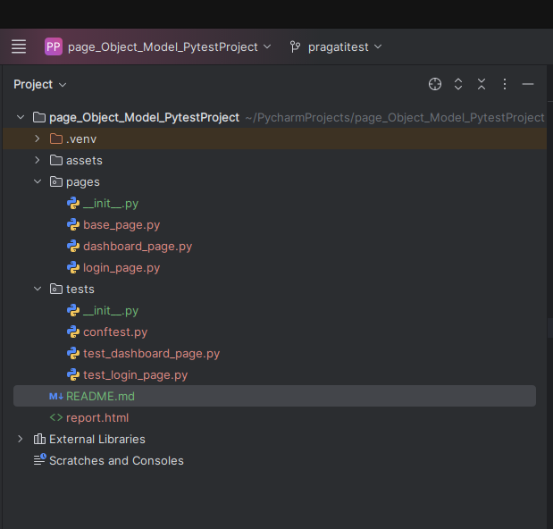

**Page Object Model framework using PyTest(Python).**

To implement the Page Object Model (POM) in PyTest,organized the test cases and page objects in a way that promotes reusability, readability, and maintainability.

1.Create Page Objects: Define a separate class for each page of your web application. Each class should encapsulate the elements and actions of the corresponding page.

2.Write Test Cases: Implement your test cases as pytest test functions or methods. These test functions should interact with the page objects to perform actions and assertions.

3.Use Fixtures for Setup and Teardown: Utilize pytest fixtures for setup and teardown operations such as initializing the browser, navigating to URLs, and closing the browser.

Project Structure :

**Execute the tests**
 _pytest -s --html=report.html --self-contained-html_

